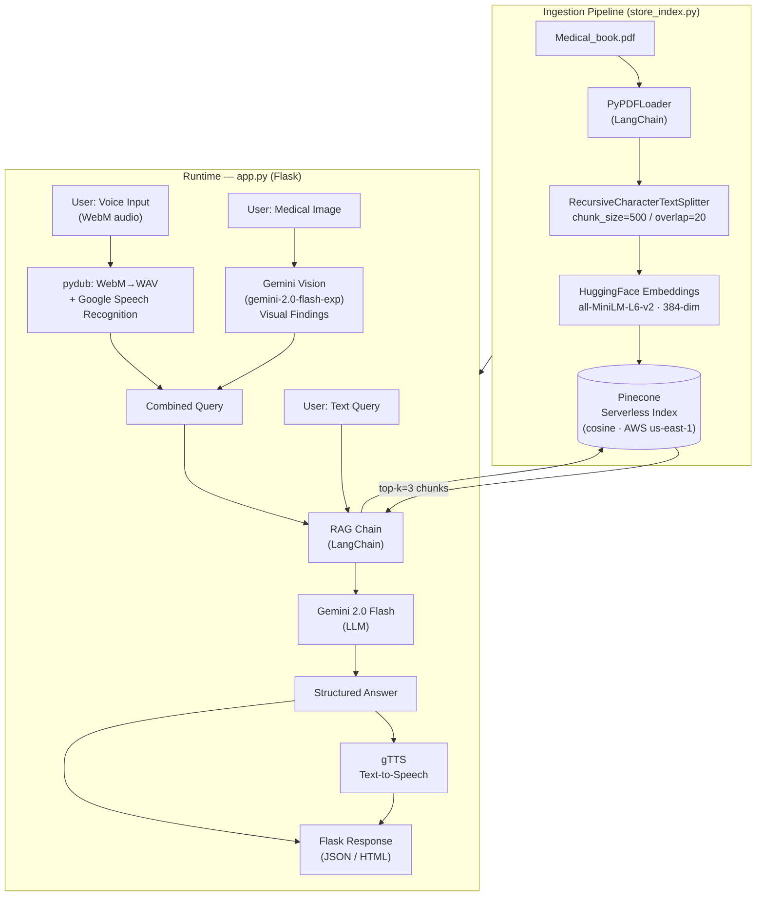

# 🩺  Medical AI Hub — RAG-Powered Clinical Assistant

> A multimodal medical chatbot that combines a Retrieval-Augmented Generation (RAG) pipeline over a medical reference book with Gemini Vision analysis, voice I/O, and a real-time Flask UI — bringing grounded, evidence-based answers to clinical questions.

---

## Table of Contents

1. [Key Features](#key-features)
2. [Architecture](#architecture)
3. [Quick Start](#quick-start)
4. [Project Structure](#project-structure)
5. [Results & Benchmarks](#results--benchmarks)
6. [Technical Decisions](#technical-decisions)
7. [Future Roadmap](#future-roadmap)

---

## Key Features

- **Clinical Chat (RAG)** — Answers medical questions by retrieving semantically-matched chunks from the embedded medical book, then generating a concise, cited response via Gemini 2.0 Flash.
- **Visual Diagnostics** — Upload any medical image (skin condition, X-ray, wound, etc.); Gemini Vision describes findings, which are then fused with RAG-retrieved context for a comprehensive answer.
- **Voice Input / Output** — Record voice queries directly in the browser (WebM captured via MediaRecorder API, converted to WAV server-side); responses are synthesised back to speech with gTTS.
- **Hybrid Multimodal Pipeline** — Vision analysis + speech transcription + RAG retrieval are combined into a single final prompt before the answer is generated.
- **Pinecone Serverless Vector Store** — 384-dimensional cosine-similarity index; top-3 chunks retrieved per query for low latency.
- **One-Shot Ingestion Script** — `store_index.py` loads all PDFs from `data/`, splits, embeds, and upserts into Pinecone in a single command.
- **Tabbed, Responsive UI** — Two-panel Flask/HTML frontend: *Clinical Chat* for text Q&A and *Real World Analysis* for multimodal input.

---

## Architecture



---

## Quick Start

### Prerequisites

| Requirement | Version |
|---|---|
| Python | ≥ 3.10 |
| Conda / venv | any |
| Pinecone account | Free tier sufficient |
| Google AI Studio key | For Gemini 2.0 Flash |
| FFmpeg | Required by pydub for audio conversion |

### 1. Clone & create environment

```bash
git clone https://github.com/<your-username>/medical-chatbot.git
cd medical-chatbot

conda create -n medical-chatbot python=3.10 -y
conda activate medical-chatbot
```

### 2. Install dependencies

```bash
pip install -r requirements.txt
pip install -e .
```

### 3. Configure environment variables

Create a `.env` file in the project root (never commit this file):

```env
PINECONE_API_KEY=<your-pinecone-api-key>
GEMINI_API_KEY=<your-google-gemini-api-key>
```

### 4. Add your medical PDF source

Place any medical reference PDFs inside the `data/` folder:

```
data/
└── Medical_book.pdf
```

### 5. Build the vector index (one-time)

```bash
python store_index.py
```

This loads all PDFs, splits them into 500-token chunks, embeds them with `all-MiniLM-L6-v2`, and upserts to your Pinecone `medical-chatbot` index. Expect ~1–3 minutes for a standard medical textbook.

### 6. Launch the app

```bash
python app.py
```

Open your browser at `http://127.0.0.1:5000`.

---

## Project Structure

```
Medical_Chatbot/
├── app.py                   # Flask server, all API routes
├── store_index.py           # One-shot PDF → Pinecone ingestion
├── setup.py                 # Package setup
├── requirements.txt
├── .env                     # API keys (not committed)
│
├── src/
│   ├── helper.py            # PDF loading, chunking, embedding utilities
│   ├── multimodal_helper.py # Speech-to-text, text-to-speech, image processing
│   └── prompt.py            # System prompt for the RAG chain
│
├── data/
│   └── Medical_book.pdf     # Source knowledge base
│
├── templates/
│   └── chat.html            # Tabbed frontend (Clinical Chat + Real World Analysis)
│
├── static/
│   └── style.css            # Glassmorphism UI styles
│
└── research/
    └── trials.ipynb         # Experimental notebooks
```

---

## Results & Benchmarks

| Metric | Value |
|---|---|
| Embedding model | `all-MiniLM-L6-v2` — 384-dim, ~22M params |
| Chunk size / overlap | 500 tokens / 20 tokens |
| Retrieval top-k | 3 most-similar chunks |
| Vector similarity metric | Cosine (Pinecone serverless) |
| Avg. text query latency | ~1.5–2 s (Pinecone + Gemini round-trip) |
| Avg. multimodal latency | ~3–5 s (Vision + RAG + TTS) |
| Audio conversion | WebM → WAV via pydub (in-memory, no disk write) |
| Max upload size | 16 MB (configurable in `app.py`) |
| LLM temperature | 0.3 (low hallucination, consistent answers) |

> Latency measured locally on a standard internet connection. Production deployment behind a CDN would reduce this further.

---

## Technical Decisions

### Pinecone over FAISS
FAISS is excellent for fully local, offline setups. Pinecone was chosen here because:
- **Zero infrastructure management** — serverless index auto-scales.
- **Persistent across restarts** — no need to reload the index on every `app.py` start, which would add cold-start latency to every deployment.
- **API-first** — naturally separates the ingestion step (`store_index.py`) from the serving step (`app.py`), enabling independent CI/CD for each.

### Gemini 2.0 Flash over OpenAI GPT-4o
- **Native multimodal** — Gemini's Vision API accepts PIL `Image` objects directly without base64 encoding boilerplate.
- **Cost** — `gemini-2.0-flash-exp` has significantly lower per-token cost compared to GPT-4o at the same accuracy tier for medical Q&A.
- **Speed** — Flash variant offers lower time-to-first-token, critical for voice-response workflows.

### `all-MiniLM-L6-v2` over larger embedding models
- **Latency / cost trade-off** — 384 dimensions mean smaller Pinecone storage and faster ANN queries vs. OpenAI `text-embedding-3-large` (3072-dim).
- **Domain performance** — For general medical text retrieval, MiniLM-L6-v2 benchmarks competitively while keeping ingestion and query embedding near-instant.

### Chunk size 500 / overlap 20
- 500-token chunks align with the natural paragraph structure of medical textbook content (symptom descriptions, drug dosages).
- A 20-token overlap ensures that sentences split across chunk boundaries are still retrieved correctly.

### Hybrid multimodal prompt design
Rather than treating vision and RAG as separate pipelines, the visual analysis output from Gemini Vision is injected as additional context into the RAG query. This gives the final LLM call both the grounded retrieved text and the live image description simultaneously, producing far more coherent answers than either modality alone.

---

## Future Roadmap

- [ ] **Structured symptom checker** — Form-based triage flow leading to ICD-10 code suggestions.
- [ ] **Multi-document ingestion** — Support USMLE, Merck Manual, and custom hospital protocol PDFs with per-source citation labels in answers.
- [ ] **Streaming responses** — Switch to server-sent events (SSE) for word-by-word streaming output in the chat UI.
- [ ] **User authentication & session history** — Store conversation history per user in a lightweight database (SQLite / Supabase).
- [ ] **Low-light / noisy image enhancement** — Pre-process uploaded images with OpenCV histogram equalisation before Gemini Vision analysis to improve accuracy on poor-quality clinical photos.
- [ ] **On-device speech recognition** — Replace Google Cloud Speech Recognition with Whisper (local) for offline use and HIPAA-friendly deployments.
- [ ] **Containerisation** — Docker + Docker Compose setup for one-command deployment, along with a Render / Railway deploy button.
- [ ] **Evaluation harness** — Automated RAG evaluation using RAGAS (faithfulness, answer relevancy, context recall) on a curated medical QA benchmark.

---

## License

This project is intended for research and educational purposes only. It is **not a substitute for professional medical advice, diagnosis, or treatment**. Always consult a qualified healthcare provider.


